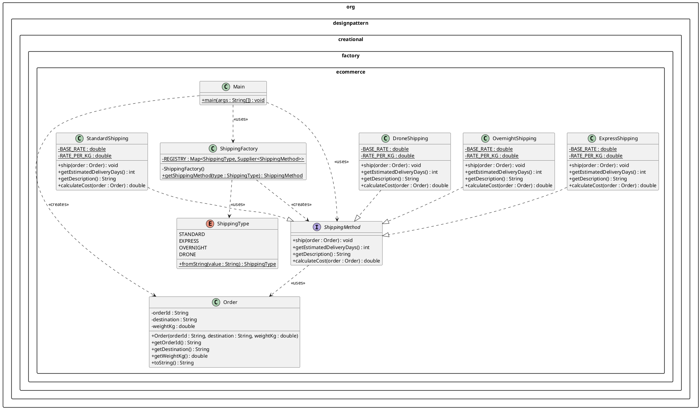
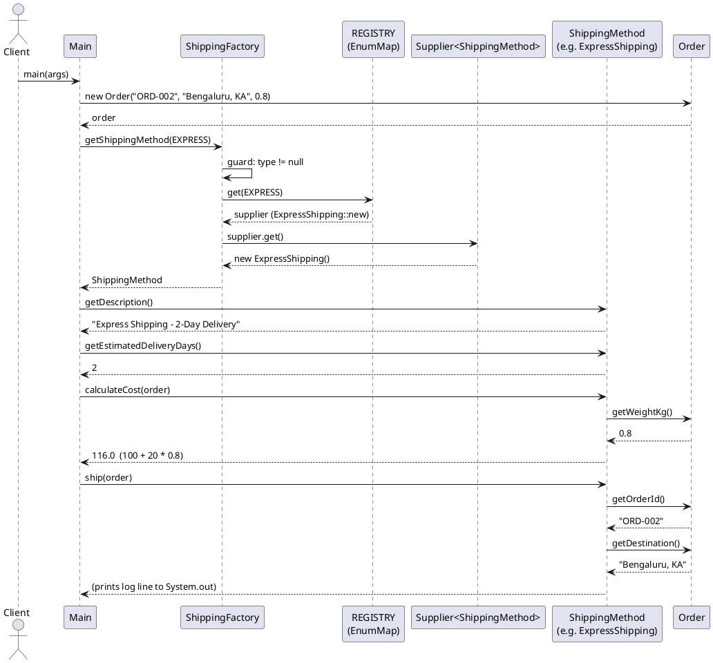

# Design Document — ecommerce-shipping-factory

## Overview

This feature implements the **Factory Design Pattern** combined with the **Open/Closed Principle
(OCP)** using an e-commerce shipping domain. The goal is to demonstrate how a `ShippingFactory`
can resolve concrete `ShippingMethod` implementations at runtime without any `if`/`else`/`switch`
branching — using a `Map<ShippingType, Supplier<ShippingMethod>>` registry instead.

The existing `LowLevelDesign` project already contains a `DatabaseFactory` that *violates* OCP
because it uses `if/else if` branches. This feature sits in a sibling package
(`org.designpattern.creational.factory.ecommerce`) and shows the correct, OCP-compliant
alternative. Adding a fifth shipping type in the future requires adding **one new class** and **one
registry entry** — zero modifications to `ShippingFactory` or any existing class.

The deliverable is a self-contained Java skeleton that compiles under Java 17 / Maven, along
with a `README.md` containing a PlantUML class diagram and pattern explanation prose.

---

## Architecture

### Package Layout

```
org.designpattern.creational.factory.ecommerce
├── ShippingMethod.java          ← product interface
├── ShippingType.java            ← enum (STANDARD, EXPRESS, OVERNIGHT, DRONE)
├── Order.java                   ← immutable value object
├── StandardShipping.java        ← concrete product
├── ExpressShipping.java         ← concrete product
├── OvernightShipping.java       ← concrete product
├── DroneShipping.java           ← concrete product  (OCP extension example)
├── ShippingFactory.java         ← factory / creator (registry-based, OCP-compliant)
└── Main.java                    ← demo entry point
```

### Relationship Overview

```
ShippingType (enum)
     │  used as key
     ▼
ShippingFactory ──registry──► Map<ShippingType, Supplier<ShippingMethod>>
     │
     │ returns
     ▼
ShippingMethod (interface) ◄──── StandardShipping
                           ◄──── ExpressShipping
                           ◄──── OvernightShipping
                           ◄──── DroneShipping
     │ ship(Order)
     ▼
Order (value object)
```

`Main` talks only to `ShippingFactory` and `ShippingMethod` — it never names a concrete class.
`ShippingFactory` talks only to the interface via `Supplier<ShippingMethod>` — it never names a
concrete class outside the static initialiser block.

### OCP Compliance — How Extension Works

The `ShippingFactory` registry is populated once in a static initialiser. Adding **DroneShipping**
(or any future type) follows this three-step process:

1. Create a new class that `implements ShippingMethod` — no existing file is touched.
2. Add a corresponding constant to `ShippingType` (enum extension, not modification of the factory).
3. Add one entry to the registry `Map` in `ShippingFactory`'s static initialiser.

No `if`/`else`/`switch` block in `ShippingFactory` ever needs to be modified. This is exactly
what OCP means: **open for extension, closed for modification**.

Compare to the existing `DatabaseFactory` in this project, which adds an `else if` branch for
every new database — a direct OCP violation.

---

## Components and Interfaces

### 1. `ShippingMethod` Interface

```java
package org.designpattern.creational.factory.ecommerce;

/**
 * Product interface for the Factory pattern.
 * Every concrete shipping strategy implements this interface.
 * Callers are programmed against this abstraction, never against concrete types.
 */
public interface ShippingMethod {

    /**
     * Executes the shipment for the given order.
     *
     * @param order the order to ship; must not be null
     * @throws IllegalArgumentException if order is null
     */
    void ship(Order order);

    /**
     * Returns the estimated number of business days for delivery.
     *
     * @return a non-negative integer representing delivery days
     */
    int getEstimatedDeliveryDays();

    /**
     * Returns a human-readable description of this shipping tier.
     *
     * @return non-null, non-blank string identifying the tier by name
     */
    String getDescription();

    /**
     * Calculates the shipping cost in INR for the given order.
     * Each tier applies its own base rate and per-kg rate.
     *
     * @param order the order to price; must not be null
     * @return a positive double representing the cost in INR
     * @throws IllegalArgumentException if order is null
     */
    double calculateCost(Order order);
}
```

### 2. `ShippingType` Enum

```java
package org.designpattern.creational.factory.ecommerce;

/**
 * Type-safe enumeration of all supported shipping modes.
 * Using an enum prevents raw-string comparisons scattered across the codebase.
 */
public enum ShippingType {

    STANDARD,
    EXPRESS,
    OVERNIGHT,
    DRONE;

    /**
     * Resolves a ShippingType from a string in a case-insensitive manner.
     *
     * @param value the string representation; must not be null
     * @return the matching ShippingType constant
     * @throws IllegalArgumentException if value is null or does not match any constant
     */
    public static ShippingType fromString(String value) {
        if (value == null) {
            throw new IllegalArgumentException("ShippingType string value must not be null");
        }
        for (ShippingType type : ShippingType.values()) {
            if (type.name().equalsIgnoreCase(value)) {
                return type;
            }
        }
        throw new IllegalArgumentException(
            "Unknown ShippingType: '" + value + "'. Valid values: STANDARD, EXPRESS, OVERNIGHT, DRONE"
        );
    }
}
```

### 3. `Order` Value Object

```java
package org.designpattern.creational.factory.ecommerce;

/**
 * Immutable value object carrying all context a ShippingMethod needs.
 * Validated eagerly in the constructor so that only well-formed Orders exist.
 */
public final class Order {

    private final String orderId;
    private final String destination;
    private final double weightKg;

    /**
     * Constructs a valid Order.
     *
     * @param orderId     non-null, non-blank order identifier
     * @param destination non-null, non-blank delivery address
     * @param weightKg    package weight; must be in range (0.0, 1000.0]
     * @throws IllegalArgumentException on any invalid argument
     */
    public Order(String orderId, String destination, double weightKg) { ... }

    /** @return the orderId exactly as supplied to the constructor */
    public String getOrderId() { ... }

    /** @return the destination exactly as supplied to the constructor */
    public String getDestination() { ... }

    /** @return the weightKg exactly as supplied to the constructor */
    public double getWeightKg() { ... }

    /**
     * Returns a string in the form: Order{orderId='ORD-001', destination='Mumbai, MH', weightKg=2.5}
     */
    @Override
    public String toString() { ... }

    // No setters — Order is immutable by design.
}
```

**Validation rules (enforced in constructor):**
- `orderId` null or blank → `IllegalArgumentException("orderId must not be null or blank")`
- `destination` null or blank → `IllegalArgumentException("destination must not be null or blank")`
- `weightKg <= 0 || weightKg > 1000.0` → `IllegalArgumentException("weightKg out of range (0, 1000]: <value>")`

### 4. Concrete Shipping Classes

All four classes are structurally identical — no shared abstract base — so each is independently
substitutable and independently compilable.

#### `StandardShipping`

```java
package org.designpattern.creational.factory.ecommerce;

/** Economy tier — delivers within 5 business days. */
public class StandardShipping implements ShippingMethod {

    private static final double BASE_RATE   = 50.0;
    private static final double RATE_PER_KG = 10.0;

    @Override
    public void ship(Order order) {
        if (order == null) throw new IllegalArgumentException("Order must not be null");
        System.out.println("[Standard Shipping] Shipping order " + order.getOrderId()
            + " to " + order.getDestination());
    }

    @Override
    public int getEstimatedDeliveryDays() { return 5; }

    @Override
    public String getDescription() { return "Standard Shipping - Economy (5 business days)"; }

    @Override
    public double calculateCost(Order order) {
        if (order == null) throw new IllegalArgumentException("Order must not be null");
        return BASE_RATE + RATE_PER_KG * order.getWeightKg();
    }
}
```

#### `ExpressShipping`

```java
package org.designpattern.creational.factory.ecommerce;

/** Express tier — delivers within 2 business days. */
public class ExpressShipping implements ShippingMethod {

    private static final double BASE_RATE   = 100.0;
    private static final double RATE_PER_KG = 20.0;

    @Override
    public void ship(Order order) {
        if (order == null) throw new IllegalArgumentException("Order must not be null");
        System.out.println("[Express Shipping] Shipping order " + order.getOrderId()
            + " to " + order.getDestination());
    }

    @Override
    public int getEstimatedDeliveryDays() { return 2; }

    @Override
    public String getDescription() { return "Express Shipping - 2-Day Delivery"; }

    @Override
    public double calculateCost(Order order) {
        if (order == null) throw new IllegalArgumentException("Order must not be null");
        return BASE_RATE + RATE_PER_KG * order.getWeightKg();
    }
}
```

#### `OvernightShipping`

```java
package org.designpattern.creational.factory.ecommerce;

/** Overnight tier — next-day guaranteed delivery. */
public class OvernightShipping implements ShippingMethod {

    private static final double BASE_RATE   = 200.0;
    private static final double RATE_PER_KG = 30.0;

    @Override
    public void ship(Order order) {
        if (order == null) throw new IllegalArgumentException("Order must not be null");
        System.out.println("[Overnight Shipping] Shipping order " + order.getOrderId()
            + " to " + order.getDestination());
    }

    @Override
    public int getEstimatedDeliveryDays() { return 1; }

    @Override
    public String getDescription() { return "Overnight Shipping - Next-Day Guaranteed"; }

    @Override
    public double calculateCost(Order order) {
        if (order == null) throw new IllegalArgumentException("Order must not be null");
        return BASE_RATE + RATE_PER_KG * order.getWeightKg();
    }
}
```

#### `DroneShipping`

```java
package org.designpattern.creational.factory.ecommerce;

/**
 * Drone tier — same-day autonomous delivery.
 *
 * OCP NOTE: This class was added as an Open/Closed Principle extension.
 * ShippingFactory and all pre-existing shipping classes (Standard, Express, Overnight)
 * were NOT modified to accommodate this new type. Only this new class and one registry
 * entry in ShippingFactory's static initialiser were required.
 */
public class DroneShipping implements ShippingMethod {

    private static final double BASE_RATE   = 300.0;
    private static final double RATE_PER_KG = 50.0;

    @Override
    public void ship(Order order) {
        if (order == null) throw new IllegalArgumentException("Order must not be null");
        System.out.println("[Drone Shipping] Shipping order " + order.getOrderId()
            + " to " + order.getDestination());
    }

    @Override
    public int getEstimatedDeliveryDays() { return 0; }

    @Override
    public String getDescription() { return "Drone Shipping - Same-Day Autonomous Delivery"; }

    @Override
    public double calculateCost(Order order) {
        if (order == null) throw new IllegalArgumentException("Order must not be null");
        return BASE_RATE + RATE_PER_KG * order.getWeightKg();
    }
}
```

### 5. `ShippingFactory`

```java
package org.designpattern.creational.factory.ecommerce;

import java.util.Collections;
import java.util.EnumMap;
import java.util.Map;
import java.util.function.Supplier;

/**
 * OCP-compliant Factory for ShippingMethod instances.
 *
 * <p>The registry (Map<ShippingType, Supplier<ShippingMethod>>) is the sole
 * OCP extension point. To add a new shipping type, add a new class that implements
 * ShippingMethod and register its Supplier here — zero modifications to any other
 * part of this factory or to any existing shipping class are required.</p>
 */
public class ShippingFactory {

    // Registry: maps every ShippingType to a factory Supplier.
    // This is the ONLY place concrete class names appear in this file.
    private static final Map<ShippingType, Supplier<ShippingMethod>> REGISTRY;

    static {
        Map<ShippingType, Supplier<ShippingMethod>> map = new EnumMap<>(ShippingType.class);
        map.put(ShippingType.STANDARD,   StandardShipping::new);
        map.put(ShippingType.EXPRESS,    ExpressShipping::new);
        map.put(ShippingType.OVERNIGHT,  OvernightShipping::new);
        map.put(ShippingType.DRONE,      DroneShipping::new);
        REGISTRY = Collections.unmodifiableMap(map);
    }

    // Private constructor — utility class, not meant to be instantiated.
    private ShippingFactory() {}

    /**
     * Returns a new ShippingMethod instance for the given type.
     *
     * @param type the desired shipping type; must not be null
     * @return a fresh ShippingMethod implementation
     * @throws IllegalArgumentException if type is null or not found in registry
     */
    public static ShippingMethod getShippingMethod(ShippingType type) {
        if (type == null) {
            throw new IllegalArgumentException("ShippingType must not be null");
        }
        Supplier<ShippingMethod> supplier = REGISTRY.get(type);
        if (supplier == null) {
            // Guard against incomplete registry after adding a new ShippingType constant
            throw new IllegalArgumentException("No ShippingMethod registered for type: " + type);
        }
        return supplier.get();
    }
}
```

**Key design decision — `Supplier<ShippingMethod>` vs direct instances:** The registry stores
`Supplier` references (method references to constructors) rather than pre-built instances. This
ensures `getShippingMethod` always returns a **fresh object**, avoiding shared mutable state if
concrete classes ever acquire fields in the future. The cost is negligible for this use case.

**Key design decision — `EnumMap`:** `EnumMap` provides O(1) lookup backed by an array indexed
by ordinal. It is the idiomatic collection for enum-keyed maps in Java and produces no boxing
overhead.

### 6. `Main` Demo Class

```java
package org.designpattern.creational.factory.ecommerce;

import java.util.LinkedHashMap;
import java.util.Map;

/**
 * End-to-end demonstration of the Factory pattern + OCP.
 * Notice: no concrete shipping class name appears anywhere in this file.
 * All instances are obtained exclusively through ShippingFactory.
 *
 * NOTE: Orders are paired to ShippingTypes via an explicit LinkedHashMap,
 * not array indices, so adding new ShippingType constants never silently
 * breaks the pairing.
 */
public class Main {

    public static void main(String[] args) {

        // Explicit pairing — safe against ShippingType.values() reordering
        Map<ShippingType, Order> shipments = new LinkedHashMap<>();
        shipments.put(ShippingType.STANDARD,   new Order("ORD-001", "Mumbai, MH",     2.5));
        shipments.put(ShippingType.EXPRESS,    new Order("ORD-002", "Bengaluru, KA",  0.8));
        shipments.put(ShippingType.OVERNIGHT,  new Order("ORD-003", "Delhi, DL",      5.0));
        shipments.put(ShippingType.DRONE,      new Order("ORD-004", "Pune, MH",       0.3));

        for (Map.Entry<ShippingType, Order> entry : shipments.entrySet()) {
            ShippingMethod method = ShippingFactory.getShippingMethod(entry.getKey());
            Order order = entry.getValue();

            // Description, ETA, and cost printed BEFORE ship() call
            System.out.printf("Method : %s%n", method.getDescription());
            System.out.printf("ETA    : %d day(s)%n", method.getEstimatedDeliveryDays());
            System.out.printf("Cost   : ₹%.2f%n", method.calculateCost(order));
            method.ship(order);
            System.out.println();
        }
    }
}
```

---

## Data Models

### `Order` — field layout

| Field         | Type     | Constraints                    | Accessor            |
|---------------|----------|-------------------------------|---------------------|
| `orderId`     | `String` | non-null, non-blank            | `getOrderId()`      |
| `destination` | `String` | non-null, non-blank            | `getDestination()`  |
| `weightKg`    | `double` | `0 < weightKg <= 1000.0`       | `getWeightKg()`     |

The class is declared `final` and carries no setters, making it deeply immutable (all fields are
value types or immutable `String`).

### `ShippingType` — enum constants

| Constant    | `fromString` aliases (case-insensitive) | Concrete class       | Delivery days |
|-------------|------------------------------------------|----------------------|---------------|
| `STANDARD`  | "standard", "STANDARD", "Standard", …   | `StandardShipping`   | 5             |
| `EXPRESS`   | "express", "EXPRESS", …                 | `ExpressShipping`    | 2             |
| `OVERNIGHT` | "overnight", "OVERNIGHT", …             | `OvernightShipping`  | 1             |
| `DRONE`     | "drone", "DRONE", …                     | `DroneShipping`      | 0             |

---

## PlantUML Class Diagram



---

## Sequence Diagram

The diagram below shows the runtime call flow for a single shipping request through the Factory.



**Key observations from the sequence:**
- `Main` never holds a reference to `ExpressShipping` — only to `ShippingMethod`
- `ShippingFactory` delegates creation entirely to the `Supplier` in the registry
- `Order` is the single shared context object passed through all three methods (`calculateCost`, `ship`)
- To add a new shipping type, only the `Supplier` registration step (SF → R) changes

---

## Correctness Properties

*A property is a characteristic or behavior that should hold true across all valid executions of
a system — essentially, a formal statement about what the system should do. Properties serve as
the bridge between human-readable specifications and machine-verifiable correctness guarantees.*

### Property 1: ShippingMethod interface contract

*For any* `ShippingMethod` instance returned by `ShippingFactory` for any `ShippingType` constant,
`getEstimatedDeliveryDays()` must return a value greater than or equal to zero, and `getDescription()`
must return a non-null, non-blank string.

**Validates: Requirements 1.3, 1.4**

---

### Property 2: ship(null) always throws

*For any* concrete `ShippingMethod` implementation, calling `ship(null)` must throw an
`IllegalArgumentException` whose message is non-null and non-blank.

**Validates: Requirements 1.2**

---

### Property 3: Order constructor round-trip

*For any* valid combination of non-blank `orderId`, non-blank `destination`, and `weightKg` in
range `(0.0, 1000.0]`, constructing an `Order` and then reading back all three fields via getters
must return values that are equal (by `equals`/`==`) to those supplied to the constructor.

**Validates: Requirements 2.1, 2.2, 2.3**

---

### Property 4: Order rejects blank string fields

*For any* string that is `null` or composed entirely of whitespace characters, passing it as
either `orderId` or `destination` to the `Order` constructor must throw an
`IllegalArgumentException` whose message identifies the offending field by name.

**Validates: Requirements 2.5, 2.6**

---

### Property 5: Order rejects out-of-range weight

*For any* `weightKg` value that is `<= 0.0` or `> 1000.0`, the `Order` constructor must throw an
`IllegalArgumentException` whose message contains a string representation of the invalid value.

**Validates: Requirements 2.7**

---

### Property 6: ShippingType.fromString case-insensitive round-trip

*For any* `ShippingType` constant `T` and any string formed by any mixed-case permutation of
`T.name()`, `ShippingType.fromString(permutation)` must return `T`.

**Validates: Requirements 3.2**

---

### Property 7: ShippingType.fromString rejects unknown values

*For any* non-null string that does not case-insensitively match any `ShippingType` constant name,
`ShippingType.fromString(value)` must throw an `IllegalArgumentException` whose message contains
the input string.

**Validates: Requirements 3.4**

---

### Property 8: Factory returns correct concrete type for every ShippingType

*For any* `ShippingType` constant, `ShippingFactory.getShippingMethod(type)` must return an
object whose runtime class is exactly the concrete class registered for that type
(`StandardShipping` for `STANDARD`, `ExpressShipping` for `EXPRESS`, `OvernightShipping` for
`OVERNIGHT`, `DroneShipping` for `DRONE`).

**Validates: Requirements 5.2, 5.3, 5.4, 5.5**

---

### Property 9: ship(order) output contains required tokens

*For any* valid `Order` and any `ShippingMethod` implementation, calling `ship(order)` must write
to `System.out` at least one line that contains, as distinct non-adjacent tokens, the shipping
tier name, `order.getOrderId()`, and `order.getDestination()`.

**Validates: Requirements 4.5**

---

### Property 10: calculateCost returns positive value for all valid orders

*For any* `ShippingMethod` instance returned by `ShippingFactory` and any valid `Order`
(weightKg in `(0.0, 1000.0]`), `calculateCost(order)` must return a value strictly greater
than zero. The cost must also increase monotonically as `weightKg` increases for the same tier.

**Validates: Requirements 1.5, 4.8**

---

### Property 11: calculateCost(null) always throws

*For any* concrete `ShippingMethod` implementation, calling `calculateCost(null)` must throw an
`IllegalArgumentException` whose message is non-null and non-blank.

**Validates: Requirements 1.6, 4.9**

---

## Error Handling

| Scenario | Class | Exception | Message contract |
|---|---|---|---|
| `ship(null)` | All concrete classes | `IllegalArgumentException` | Non-blank message |
| `calculateCost(null)` | All concrete classes | `IllegalArgumentException` | Non-blank message |
| `Order(null/blank orderId, ...)` | `Order` | `IllegalArgumentException` | Contains "orderId" |
| `Order(..., null/blank destination, ...)` | `Order` | `IllegalArgumentException` | Contains "destination" |
| `Order(..., invalidWeight)` | `Order` | `IllegalArgumentException` | Contains the invalid numeric value |
| `ShippingFactory.getShippingMethod(null)` | `ShippingFactory` | `IllegalArgumentException` | `"ShippingType must not be null"` |
| `ShippingFactory.getShippingMethod(unregistered)` | `ShippingFactory` | `IllegalArgumentException` | Contains the unregistered type name |
| `ShippingType.fromString(null)` | `ShippingType` | `IllegalArgumentException` | Non-blank message |
| `ShippingType.fromString(unknown)` | `ShippingType` | `IllegalArgumentException` | Contains the input value |

All validation is **fail-fast**: errors are thrown at construction/call time, never deferred.
No checked exceptions are used — `IllegalArgumentException` is the uniform contract throughout.

---

## Testing Strategy

### Dual Testing Approach

Unit tests verify specific examples and edge cases. Property tests verify universal invariants
across a large, randomized input space. Both are complementary.

### Property-Based Testing Library

Use **[jqwik](https://jqwik.net/)** — the standard property-based testing library for Java, built
on JUnit 5. Add the dependency to `pom.xml`:

```xml
<dependency>
    <groupId>net.jqwik</groupId>
    <artifactId>jqwik</artifactId>
    <version>1.8.4</version>
    <scope>test</scope>
</dependency>
<dependency>
    <groupId>org.junit.jupiter</groupId>
    <artifactId>junit-jupiter</artifactId>
    <version>5.10.2</version>
    <scope>test</scope>
</dependency>
```

Each `@Property` test runs **100 iterations minimum** (jqwik default is 1000 — no override needed).

### Property Tests (one `@Property` method per correctness property)

```
Feature: ecommerce-shipping-factory, Property 1: ShippingMethod interface contract
Feature: ecommerce-shipping-factory, Property 2: ship(null) always throws
Feature: ecommerce-shipping-factory, Property 3: Order constructor round-trip
Feature: ecommerce-shipping-factory, Property 4: Order rejects blank string fields
Feature: ecommerce-shipping-factory, Property 5: Order rejects out-of-range weight
Feature: ecommerce-shipping-factory, Property 6: ShippingType.fromString case-insensitive round-trip
Feature: ecommerce-shipping-factory, Property 7: ShippingType.fromString rejects unknown values
Feature: ecommerce-shipping-factory, Property 8: Factory returns correct concrete type for every ShippingType
Feature: ecommerce-shipping-factory, Property 9: ship(order) output contains required tokens
```

**Generators needed:**
- `@ForAll ShippingType type` — jqwik generates all enum constants automatically.
- `@ForAll @NotBlank String orderId` — use `@AlphaChars @StringLength(min=1)` or
  `Arbitraries.strings().withCharRange('a', 'z').ofMinLength(1)`.
- `@ForAll("validWeights") double weightKg` — custom `@Provide` method generating doubles in
  `(0.0, 1000.0]`.
- `@ForAll("invalidWeights") double weightKg` — doubles `<= 0` or `> 1000`.
- `@ForAll("blankStrings") String blank` — strings of spaces/tabs/newlines.
- `@ForAll("unknownShippingStrings") String unknown` — strings that don't match any
  `ShippingType.name()`.
- Capturing `System.out`: redirect via `ByteArrayOutputStream` before each test, restore after.

### Unit Tests (example-based, `@Test`)

| Test | What it verifies |
|---|---|
| Concrete delivery days for each class | `StandardShipping` → 5, `Express` → 2, `Overnight` → 1, `Drone` → 0 |
| `ShippingFactory.getShippingMethod(null)` | Throws with exact message `"ShippingType must not be null"` |
| `ShippingType.fromString(null)` | Throws `IllegalArgumentException` |
| `ShippingType` has exactly 4 constants | `ShippingType.values().length == 4` |
| Each concrete class has `Object` as superclass | No shared abstract base (reflection check) |
| `Order` has no public setter methods | Reflection: no method names starting with `set` |
| `Main.main` produces four output blocks | Capture stdout, assert four non-empty lines per method |

### Test Class Layout

```
src/test/java/org/designpattern/creational/factory/ecommerce/
├── OrderPropertyTest.java        ← Properties 3, 4, 5
├── ShippingTypePropertyTest.java ← Properties 6, 7
├── ShippingMethodPropertyTest.java ← Properties 1, 2, 9
├── ShippingFactoryPropertyTest.java ← Property 8
└── ShippingFactoryUnitTest.java  ← Unit / example-based tests
```
