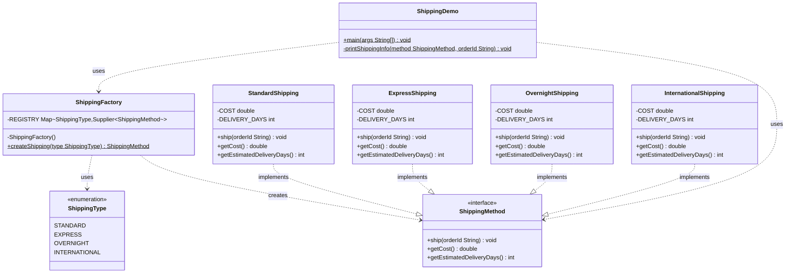
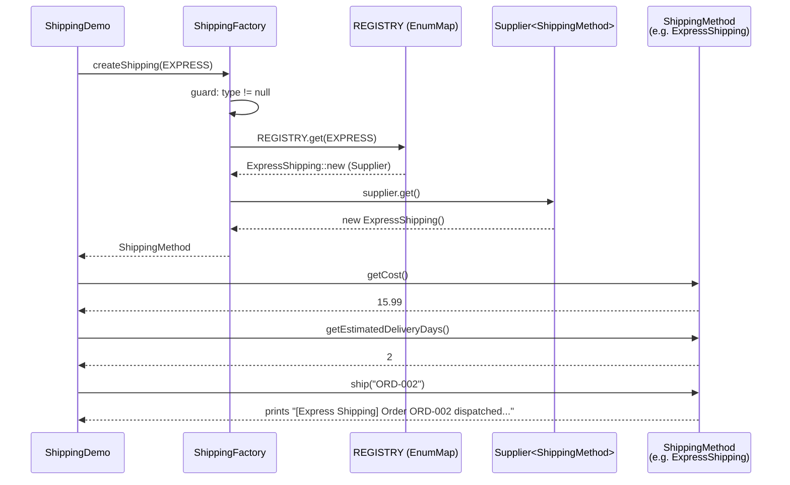

# Design Document — ecommerce-shipping

## Overview

This feature implements the **Factory Design Pattern** combined with the **Open/Closed Principle
(OCP)** in a Java e-commerce shipping domain. The goal is to demonstrate how a `ShippingFactory`
resolves the correct `ShippingMethod` implementation at runtime — without any `if`/`else`/`switch`
branching — using a `Map<ShippingType, Supplier<ShippingMethod>>` registry instead.

### Factory Pattern Intent

The Factory Pattern centralises object creation. Instead of client code calling
`new StandardShipping()`, `new ExpressShipping()`, etc., it calls a single factory method:

```java
ShippingMethod method = ShippingFactory.createShipping(ShippingType.EXPRESS);
```

The client depends only on the `ShippingMethod` interface and `ShippingFactory` — never on
concrete class names. This isolates change: swapping or extending implementations touches one
place (the registry), not every call site.

### OCP Benefit

The existing `DatabaseFactory` in this project (package `withFactory`) violates OCP:

```java
// OCP violation — every new DB type forces a new else-if branch
if (dbType.equalsIgnoreCase("mysql"))      return new MySQLDatabase();
else if (dbType.equalsIgnoreCase("psql"))  return new PostgresSQLDatabse();
```

The shipping factory is **closed for modification** because dispatch is driven by a registry map.
Adding a new shipping tier (e.g., `DroneShipping`) requires:
1. One new class that `implements ShippingMethod` — no existing file is touched.
2. One new `ShippingType` enum constant.
3. One new `map.put(...)` entry in the factory's static initialiser.

`ShippingFactory`'s `createShipping` method body is never modified.

---

## Architecture

### Package Layout

All eight files live in one flat package:

```
src/main/java/org/designpattern/creational/factory/ecommerce/
├── ShippingMethod.java          ← product interface
├── ShippingType.java            ← enum: STANDARD, EXPRESS, OVERNIGHT, INTERNATIONAL
├── ShippingFactory.java         ← registry-based factory (OCP-compliant, no if/else)
├── StandardShipping.java        ← concrete product  (cost $5.99,  5–7 days)
├── ExpressShipping.java         ← concrete product  (cost $15.99, 2–3 days)
├── OvernightShipping.java       ← concrete product  (cost $29.99, 1 day)
├── InternationalShipping.java   ← concrete product  (cost $49.99, 10–15 days)
└── ShippingDemo.java            ← demo entry point (main method)
```

### Relationship Overview

```
ShippingType (enum)
     │  used as Map key
     ▼
ShippingFactory ──REGISTRY──► Map<ShippingType, Supplier<ShippingMethod>>
     │                                │
     │ createShipping(type)           │ supplier.get()
     ▼                                ▼
ShippingMethod (interface) ◄──── StandardShipping
                           ◄──── ExpressShipping
                           ◄──── OvernightShipping
                           ◄──── InternationalShipping

ShippingDemo ──► ShippingFactory   (to get instances)
ShippingDemo ──► ShippingMethod    (to call ship/getCost/getEstimatedDeliveryDays)
ShippingDemo   ✗  ConcreteShipping  (no direct dependency on concrete classes)
```

`ShippingDemo` talks only to `ShippingFactory` and `ShippingMethod`. It never imports a concrete
class. `ShippingFactory` names concrete classes only inside its static initialiser — the
`createShipping()` method body is free of all concrete references.

### OCP Compliance — Extension Without Modification

| Step | What changes | What stays the same |
|------|-------------|---------------------|
| Add `DRONE` to `ShippingType` | `ShippingType.java` | All other files |
| Create `DroneShipping implements ShippingMethod` | New file only | All existing files |
| Register in factory static initialiser | One `map.put(...)` line | `createShipping()` body |

**Zero existing lines are modified** in `ShippingMethod`, `ShippingFactory`, or any concrete class.

---

## Components and Interfaces

### 1. `ShippingMethod` — Product Interface

```java
package org.designpattern.creational.factory.ecommerce;

/**
 * Product interface for the Factory pattern.
 *
 * <p>Every concrete shipping strategy implements this interface.
 * Client code ({@link ShippingDemo}) and {@link ShippingFactory} depend only on
 * this abstraction — never on any concrete class. This is the "closed" half of OCP:
 * the interface contract never changes when new shipping variants are added.</p>
 */
public interface ShippingMethod {

    /**
     * Executes the shipment for the given order identifier and prints a confirmation.
     *
     * @param orderId the identifier of the order being shipped; must not be null or blank
     */
    void ship(String orderId);

    /**
     * Returns the flat shipping cost in USD for this tier.
     *
     * @return a positive double representing the cost (e.g., 5.99 for Standard)
     */
    double getCost();

    /**
     * Returns the estimated delivery time in days for this tier.
     *
     * @return a non-negative integer representing delivery days
     */
    int getEstimatedDeliveryDays();
}
```

### 2. `ShippingType` — Enum

```java
package org.designpattern.creational.factory.ecommerce;

/**
 * Type-safe enumeration of all supported shipping modes.
 *
 * <p>Using an enum eliminates raw-string comparisons and prevents typos at call sites.
 * When a new shipping variant is needed, add a constant here and register a
 * {@code Supplier<ShippingMethod>} in {@link ShippingFactory} — that is the only
 * file, besides the new concrete class itself, that ever needs to change.</p>
 */
public enum ShippingType {

    /** Economy ground shipping. Cost: $5.99. Delivery: 5–7 days. */
    STANDARD,

    /** Accelerated shipping. Cost: $15.99. Delivery: 2–3 days. */
    EXPRESS,

    /** Next-day guaranteed delivery. Cost: $29.99. Delivery: 1 day. */
    OVERNIGHT,

    /** Cross-border shipping. Cost: $49.99. Delivery: 10–15 days. */
    INTERNATIONAL
}
```

### 3. `ShippingFactory` — Registry-Based Factory

```java
package org.designpattern.creational.factory.ecommerce;

import java.util.Collections;
import java.util.EnumMap;
import java.util.Map;
import java.util.function.Supplier;

/**
 * OCP-compliant factory for {@link ShippingMethod} instances.
 *
 * <p><b>Design decisions:</b></p>
 * <ul>
 *   <li><b>No if/else/switch</b> — dispatch is driven entirely by the {@code REGISTRY} map.
 *       The {@code createShipping()} method body contains zero branching logic.</li>
 *   <li><b>Supplier&lt;ShippingMethod&gt; values</b> — method references to constructors
 *       (e.g., {@code StandardShipping::new}) are stored, not pre-built instances.
 *       Each {@code createShipping()} call returns a <em>fresh</em> object, avoiding
 *       shared mutable state if concrete classes ever acquire fields.</li>
 *   <li><b>EnumMap</b> — backed by an array indexed by ordinal, giving O(1) lookup
 *       with no boxing overhead; the idiomatic Java collection for enum-keyed maps.</li>
 *   <li><b>Private constructor</b> — utility class; instantiation is prevented.</li>
 * </ul>
 *
 * <p><b>Extending the factory (OCP):</b> To add {@code DroneShipping}, create that class,
 * add {@code DRONE} to {@link ShippingType}, and add one line:
 * {@code map.put(ShippingType.DRONE, DroneShipping::new);} in the static initialiser below.
 * The body of {@code createShipping()} is never touched.</p>
 */
public final class ShippingFactory {

    /**
     * Registry mapping every {@link ShippingType} to a factory {@code Supplier}.
     * Concrete class names appear <em>only</em> inside this static initialiser block.
     */
    private static final Map<ShippingType, Supplier<ShippingMethod>> REGISTRY;

    static {
        Map<ShippingType, Supplier<ShippingMethod>> map = new EnumMap<>(ShippingType.class);
        map.put(ShippingType.STANDARD,      StandardShipping::new);
        map.put(ShippingType.EXPRESS,       ExpressShipping::new);
        map.put(ShippingType.OVERNIGHT,     OvernightShipping::new);
        map.put(ShippingType.INTERNATIONAL, InternationalShipping::new);
        REGISTRY = Collections.unmodifiableMap(map);
    }

    /** Utility class — not instantiable. */
    private ShippingFactory() {}

    /**
     * Returns a fresh {@link ShippingMethod} instance for the requested shipping type.
     *
     * @param type the desired shipping tier; must not be {@code null}
     * @return a new {@code ShippingMethod} implementation for the given type
     * @throws IllegalArgumentException if {@code type} is {@code null} or
     *         not found in the registry (guards against incomplete registry)
     */
    public static ShippingMethod createShipping(ShippingType type) {
        if (type == null) {
            throw new IllegalArgumentException(
                "ShippingType must not be null. Valid values: " +
                java.util.Arrays.toString(ShippingType.values()));
        }
        Supplier<ShippingMethod> supplier = REGISTRY.get(type);
        if (supplier == null) {
            throw new IllegalArgumentException(
                "No ShippingMethod registered for type: " + type +
                ". Ensure a Supplier is added to ShippingFactory.REGISTRY.");
        }
        return supplier.get();
    }
}
```

### 4. Concrete Shipping Classes

All four concrete classes are structurally identical — no shared abstract base, just direct
interface implementation. This keeps them independently substitutable, independently compilable,
and free of inheritance coupling.

#### `StandardShipping`

```java
package org.designpattern.creational.factory.ecommerce;

/**
 * Economy ground shipping tier.
 *
 * <p>Registered in {@link ShippingFactory} under {@link ShippingType#STANDARD}.
 * Cost: $5.99 flat. Estimated delivery: 5–7 business days.</p>
 */
public class StandardShipping implements ShippingMethod {

    private static final double COST          = 5.99;
    private static final int    DELIVERY_DAYS = 5;   // representative lower bound of 5–7

    /**
     * {@inheritDoc}
     * Prints a standard-shipping confirmation that includes the order identifier.
     *
     * @param orderId the order identifier to include in the confirmation; must not be null
     */
    @Override
    public void ship(String orderId) {
        System.out.println("[Standard Shipping] Order " + orderId +
            " dispatched — economy ground, estimated " + DELIVERY_DAYS + " days.");
    }

    /** @return {@code 5.99} — the flat rate for standard shipping */
    @Override
    public double getCost() { return COST; }

    /** @return {@code 5} — representative lower bound of the 5–7 day window */
    @Override
    public int getEstimatedDeliveryDays() { return DELIVERY_DAYS; }
}
```

#### `ExpressShipping`

```java
package org.designpattern.creational.factory.ecommerce;

/**
 * Accelerated 2–3 day shipping tier.
 *
 * <p>Registered in {@link ShippingFactory} under {@link ShippingType#EXPRESS}.
 * Cost: $15.99 flat. Estimated delivery: 2–3 business days.</p>
 */
public class ExpressShipping implements ShippingMethod {

    private static final double COST          = 15.99;
    private static final int    DELIVERY_DAYS = 2;

    /** {@inheritDoc} */
    @Override
    public void ship(String orderId) {
        System.out.println("[Express Shipping] Order " + orderId +
            " dispatched — express delivery, estimated " + DELIVERY_DAYS + " days.");
    }

    /** @return {@code 15.99} — the flat rate for express shipping */
    @Override
    public double getCost() { return COST; }

    /** @return {@code 2} — representative lower bound of the 2–3 day window */
    @Override
    public int getEstimatedDeliveryDays() { return DELIVERY_DAYS; }
}
```

#### `OvernightShipping`

```java
package org.designpattern.creational.factory.ecommerce;

/**
 * Next-day guaranteed shipping tier.
 *
 * <p>Registered in {@link ShippingFactory} under {@link ShippingType#OVERNIGHT}.
 * Cost: $29.99 flat. Estimated delivery: 1 business day.</p>
 */
public class OvernightShipping implements ShippingMethod {

    private static final double COST          = 29.99;
    private static final int    DELIVERY_DAYS = 1;

    /** {@inheritDoc} */
    @Override
    public void ship(String orderId) {
        System.out.println("[Overnight Shipping] Order " + orderId +
            " dispatched — next-day guaranteed, estimated " + DELIVERY_DAYS + " day.");
    }

    /** @return {@code 29.99} — the flat rate for overnight shipping */
    @Override
    public double getCost() { return COST; }

    /** @return {@code 1} — next-day delivery */
    @Override
    public int getEstimatedDeliveryDays() { return DELIVERY_DAYS; }
}
```

#### `InternationalShipping`

```java
package org.designpattern.creational.factory.ecommerce;

/**
 * Cross-border international shipping tier.
 *
 * <p>Registered in {@link ShippingFactory} under {@link ShippingType#INTERNATIONAL}.
 * Cost: $49.99 flat. Estimated delivery: 10–15 business days.</p>
 */
public class InternationalShipping implements ShippingMethod {

    private static final double COST          = 49.99;
    private static final int    DELIVERY_DAYS = 10;  // representative lower bound of 10–15

    /** {@inheritDoc} */
    @Override
    public void ship(String orderId) {
        System.out.println("[International Shipping] Order " + orderId +
            " dispatched — international cross-border, estimated " +
            DELIVERY_DAYS + " days.");
    }

    /** @return {@code 49.99} — the flat rate for international shipping */
    @Override
    public double getCost() { return COST; }

    /** @return {@code 10} — representative lower bound of the 10–15 day window */
    @Override
    public int getEstimatedDeliveryDays() { return DELIVERY_DAYS; }
}
```

### 5. `ShippingDemo` — Entry Point

```java
package org.designpattern.creational.factory.ecommerce;

/**
 * Demonstration entry point for the Factory Pattern + OCP shipping example.
 *
 * <h2>Factory Pattern — Intent</h2>
 * <p>The Factory Pattern delegates object creation to a dedicated factory class
 * ({@link ShippingFactory}), so this demo never calls {@code new StandardShipping()},
 * {@code new ExpressShipping()}, etc. All instances are obtained through the factory,
 * and this class depends only on the {@link ShippingMethod} interface — not on any
 * concrete type. This isolates the demo from implementation details and makes it
 * trivially extensible.</p>
 *
 * <h2>Open/Closed Principle — Benefit</h2>
 * <p>If a new shipping tier is introduced (e.g., {@code DroneShipping}), this demo
 * requires <strong>zero changes</strong> as long as the new type is registered in
 * {@link ShippingFactory}. The code below is <em>closed for modification</em> even
 * as the system is <em>open for extension</em>.</p>
 *
 * <h2>Extensibility Demo (commented out)</h2>
 * <pre>
 * // Adding DroneShipping would require:
 * //   1. Create DroneShipping implements ShippingMethod
 * //   2. Add DRONE to ShippingType enum
 * //   3. Register: map.put(ShippingType.DRONE, DroneShipping::new) in ShippingFactory
 * //
 * // Then this demo works with zero modification:
 * //   ShippingMethod drone = ShippingFactory.createShipping(ShippingType.DRONE);
 * //   printShippingInfo(drone, "ORD-005");
 * </pre>
 */
public class ShippingDemo {

    /**
     * Exercises all four shipping variants via the factory.
     * Notice: no concrete class name appears anywhere in this method.
     *
     * @param args command-line arguments (unused)
     */
    public static void main(String[] args) {
        String[] orderIds = { "ORD-001", "ORD-002", "ORD-003", "ORD-004" };
        ShippingType[] types = {
            ShippingType.STANDARD,
            ShippingType.EXPRESS,
            ShippingType.OVERNIGHT,
            ShippingType.INTERNATIONAL
        };

        for (int i = 0; i < types.length; i++) {
            ShippingMethod method = ShippingFactory.createShipping(types[i]);
            printShippingInfo(method, orderIds[i]);
        }
    }

    /**
     * Prints the shipping summary and triggers dispatch for one order.
     *
     * @param method  the shipping method to use; must not be null
     * @param orderId the order identifier to ship; must not be null
     */
    private static void printShippingInfo(ShippingMethod method, String orderId) {
        System.out.printf("--- Shipping Method: %s ---%n",
            method.getClass().getSimpleName());
        System.out.printf("  Cost              : $%.2f%n",     method.getCost());
        System.out.printf("  Est. delivery     : %d day(s)%n", method.getEstimatedDeliveryDays());
        method.ship(orderId);
        System.out.println();
    }
}
```

**Key constraint**: `ShippingDemo` uses only `ShippingMethod`, `ShippingFactory`, and `ShippingType`
in its imports. No `import ...StandardShipping` or any other concrete class ever appears.

---

## Data Models

### `ShippingType` — Enum Constants

| Constant | Concrete class | `getCost()` | `getEstimatedDeliveryDays()` | Delivery window |
|---|---|---|---|---|
| `STANDARD` | `StandardShipping` | `5.99` | `5` | 5–7 business days |
| `EXPRESS` | `ExpressShipping` | `15.99` | `2` | 2–3 business days |
| `OVERNIGHT` | `OvernightShipping` | `29.99` | `1` | 1 business day |
| `INTERNATIONAL` | `InternationalShipping` | `49.99` | `10` | 10–15 business days |

> `getEstimatedDeliveryDays()` returns the **lower bound** of the delivery window as a single
> `int`. The full range (e.g., "5–7") is represented in the `ship()` output message.

### `ShippingMethod` — Interface Contract Summary

| Method | Return type | Contract |
|---|---|---|
| `ship(String orderId)` | `void` | Prints confirmation including `orderId`; must not be silent |
| `getCost()` | `double` | Returns a positive flat rate in USD |
| `getEstimatedDeliveryDays()` | `int` | Returns a non-negative integer delivery estimate |

### `ShippingFactory` — Registry

| Field | Type | Purpose |
|---|---|---|
| `REGISTRY` | `Map<ShippingType, Supplier<ShippingMethod>>` | Maps each enum constant to a constructor reference |

The map is wrapped in `Collections.unmodifiableMap` after population so it cannot be altered at
runtime. `EnumMap` is the backing implementation for O(1) ordinal-based lookup.

---

## Mermaid Class Diagram



---

## Sequence Diagram

Call flow for a single shipping request through the factory:



**Key observations:**
- `ShippingDemo` holds only a `ShippingMethod` reference — it never sees `ExpressShipping`.
- `ShippingFactory` delegates creation entirely to the `Supplier` stored in the registry.
- To add a new shipping type, only the `Registry` population step changes (one new `map.put`).
- All three interface methods (`getCost`, `getEstimatedDeliveryDays`, `ship`) are called on the
  interface reference, never on a concrete type.

---

## Correctness Properties

*A property is a characteristic or behavior that should hold true across all valid executions of a
system — essentially, a formal statement about what the system should do. Properties serve as the
bridge between human-readable specifications and machine-verifiable correctness guarantees.*

**Prework reflection notes:** The prework analysis identified the following classifications:
- Requirements 1.1–1.3 (interface structure): compile-time checks; runtime behavior of `getCost()`
  and `getEstimatedDeliveryDays()` yields two testable properties (1 and 2 below).
- Requirements 2.1–2.4 (concrete costs/days): specific constants → example-based unit tests, not
  properties.
- Requirement 2.5 (`ship()` includes orderId): universal across all inputs → Property 3.
- Requirements 3.2 (factory routing): universal across all enum values → Property 4.
- Requirements 3.3/4.3 (null guard + registration completeness): error condition → Property 5.
- Requirements 4.1–4.4 (OCP structural): architectural, not runtime testable.
- Requirements 6.3 (demo output): subsumed by Properties 1, 2, 3.

Properties 1 and 2 cover the same factory-routing concern, so they are combined after reflection
(see Property 1 below). Properties 3 and 4 are distinct (output content vs. type identity).

---

### Property 1: Factory routing and interface contract

*For any* `ShippingType` constant, `ShippingFactory.createShipping(type)` must return a non-null
`ShippingMethod` whose `getCost()` is strictly greater than zero and whose
`getEstimatedDeliveryDays()` is greater than or equal to zero.

**Validates: Requirements 1.2, 1.3, 3.1, 3.2, 4.3**

---

### Property 2: `createShipping(null)` throws with descriptive message

*For any* invocation of `ShippingFactory.createShipping(null)`, an `IllegalArgumentException`
must be thrown whose message is non-null and non-blank and references the null argument.

**Validates: Requirement 3.3**

---

### Property 3: `ship()` output always contains the orderId

*For any* `ShippingType` constant and *for any* non-null, non-blank `orderId` string,
calling `ship(orderId)` on the `ShippingMethod` returned by the factory must produce output
(captured from `System.out`) that contains the `orderId` as a substring.

**Validates: Requirement 2.5**

---

### Property 4: Factory returns the exact registered concrete type per ShippingType

*For any* `ShippingType` constant, `ShippingFactory.createShipping(type)` must return an object
whose runtime class is exactly the concrete class registered for that constant:
`StandardShipping` for `STANDARD`, `ExpressShipping` for `EXPRESS`,
`OvernightShipping` for `OVERNIGHT`, `InternationalShipping` for `INTERNATIONAL`.

**Validates: Requirements 3.2, 5.2**

---

### Property 5: Cost values are exact for all registered types

*For any* `ShippingType` constant, the `getCost()` value returned by the corresponding
`ShippingMethod` must equal the documented flat rate: `STANDARD→5.99`, `EXPRESS→15.99`,
`OVERNIGHT→29.99`, `INTERNATIONAL→49.99`.

**Validates: Requirements 2.1, 2.2, 2.3, 2.4**

---

### Property 6: Delivery days are non-negative for all registered types

*For any* `ShippingType` constant, the `getEstimatedDeliveryDays()` value returned by the
corresponding `ShippingMethod` must be greater than or equal to one (all current tiers have
at least 1 day delivery time).

**Validates: Requirements 1.3, 2.1, 2.2, 2.3, 2.4**

---

## Error Handling

| Scenario | Class | Exception | Message contract |
|---|---|---|---|
| `ShippingFactory.createShipping(null)` | `ShippingFactory` | `IllegalArgumentException` | Non-blank; lists valid `ShippingType` values |
| `ShippingFactory.createShipping(unregistered type)` | `ShippingFactory` | `IllegalArgumentException` | Contains the unregistered type name |
| `ship(null)` | All concrete classes | (no explicit check required by spec; callers must pass non-null) | — |
| `getCost()` called on any type | All concrete classes | No exception; always returns positive double | — |
| `getEstimatedDeliveryDays()` called on any type | All concrete classes | No exception; always returns non-negative int | — |

**Fail-fast policy:** The factory validates its input at the entry point of `createShipping()`.
No checked exceptions are used — `IllegalArgumentException` is the uniform contract.
Concrete classes do not perform null checks on `orderId` in `ship()` for this skeletal demo;
production code should add a guard and throw `IllegalArgumentException` with the field name.

### Guard placement rationale

The null check lives in `ShippingFactory.createShipping()` rather than in `REGISTRY.get()` or
in the `Supplier` invocation. This keeps the guard visible at the public API boundary and ensures
a single, consistent error message regardless of which `ShippingType` was requested.

The "unregistered type" guard (`supplier == null`) defends against a future state where a new
`ShippingType` constant is added to the enum but not yet registered in the factory's map — a
common mistake during OCP extension that would otherwise surface as a silent `NullPointerException`.

---

## Testing Strategy

### Dual Testing Approach

Unit tests verify specific, concrete examples — exact cost values, exact delivery days, exact
exception messages. Property tests verify universal invariants across many generated inputs,
catching edge cases that hand-written examples miss. Both are complementary; neither replaces
the other.

### Property-Based Testing Library

Use **[jqwik](https://jqwik.net/)** (v1.8.4) — the standard PBT library for Java, built on
JUnit 5. Add to `pom.xml`:

```xml
<dependencies>
    <dependency>
        <groupId>net.jqwik</groupId>
        <artifactId>jqwik</artifactId>
        <version>1.8.4</version>
        <scope>test</scope>
    </dependency>
    <dependency>
        <groupId>org.junit.jupiter</groupId>
        <artifactId>junit-jupiter</artifactId>
        <version>5.10.2</version>
        <scope>test</scope>
    </dependency>
</dependencies>
<build>
    <plugins>
        <plugin>
            <groupId>org.apache.maven.plugins</groupId>
            <artifactId>maven-surefire-plugin</artifactId>
            <version>3.2.5</version>
            <configuration>
                <includes>
                    <include>**/*Test.java</include>
                    <include>**/*Properties.java</include>
                </includes>
            </configuration>
        </plugin>
    </plugins>
</build>
```

Each `@Property` runs **1000 iterations** by default in jqwik (no override needed to meet the
100-iteration minimum).

### Property Tests

One `@Property` method per correctness property. Tag each with a comment linking it back to this
document:

```java
// Feature: ecommerce-shipping, Property 1: Factory routing and interface contract
@Property
void factoryRoutingAndInterfaceContract(@ForAll ShippingType type) {
    ShippingMethod method = ShippingFactory.createShipping(type);
    assertThat(method).isNotNull();
    assertThat(method.getCost()).isGreaterThan(0.0);
    assertThat(method.getEstimatedDeliveryDays()).isGreaterThanOrEqualTo(0);
}

// Feature: ecommerce-shipping, Property 2: createShipping(null) throws with descriptive message
@Property(tries = 1)
void createShippingNullThrows() {
    assertThatThrownBy(() -> ShippingFactory.createShipping(null))
        .isInstanceOf(IllegalArgumentException.class)
        .hasMessageNotEmpty();
}

// Feature: ecommerce-shipping, Property 3: ship() output always contains orderId
@Property
void shipOutputContainsOrderId(
        @ForAll ShippingType type,
        @ForAll @NotBlank String orderId) {
    ShippingMethod method = ShippingFactory.createShipping(type);
    ByteArrayOutputStream out = new ByteArrayOutputStream();
    System.setOut(new PrintStream(out));
    method.ship(orderId);
    System.setOut(System.out);  // restore
    assertThat(out.toString()).contains(orderId);
}

// Feature: ecommerce-shipping, Property 4: Factory returns exact registered concrete type
@Property
void factoryReturnsCorrectConcreteType(@ForAll ShippingType type) {
    ShippingMethod method = ShippingFactory.createShipping(type);
    Class<?> expectedClass = switch (type) {
        case STANDARD      -> StandardShipping.class;
        case EXPRESS       -> ExpressShipping.class;
        case OVERNIGHT     -> OvernightShipping.class;
        case INTERNATIONAL -> InternationalShipping.class;
    };
    assertThat(method).isInstanceOf(expectedClass);
}

// Feature: ecommerce-shipping, Property 5: Cost values are exact for all registered types
@Property
void costValuesAreExact(@ForAll ShippingType type) {
    double cost = ShippingFactory.createShipping(type).getCost();
    double expected = switch (type) {
        case STANDARD      -> 5.99;
        case EXPRESS       -> 15.99;
        case OVERNIGHT     -> 29.99;
        case INTERNATIONAL -> 49.99;
    };
    assertThat(cost).isEqualTo(expected);
}

// Feature: ecommerce-shipping, Property 6: Delivery days are non-negative for all registered types
@Property
void deliveryDaysArePositive(@ForAll ShippingType type) {
    int days = ShippingFactory.createShipping(type).getEstimatedDeliveryDays();
    assertThat(days).isGreaterThanOrEqualTo(1);
}
```

**Generators used:**
- `@ForAll ShippingType type` — jqwik generates all four enum constants automatically.
- `@ForAll @NotBlank String orderId` — jqwik generates non-blank strings covering ASCII,
  Unicode, whitespace-mixed, and long strings.
- `System.out` redirection via `ByteArrayOutputStream` for Property 3.

### Unit Tests (Example-Based)

| Test | What it verifies |
|---|---|
| `standardShipping_cost` | `new StandardShipping().getCost() == 5.99` |
| `expressShipping_cost` | `new ExpressShipping().getCost() == 15.99` |
| `overnightShipping_cost` | `new OvernightShipping().getCost() == 29.99` |
| `internationalShipping_cost` | `new InternationalShipping().getCost() == 49.99` |
| `standardShipping_deliveryDays` | `getEstimatedDeliveryDays() == 5` |
| `expressShipping_deliveryDays` | `getEstimatedDeliveryDays() == 2` |
| `overnightShipping_deliveryDays` | `getEstimatedDeliveryDays() == 1` |
| `internationalShipping_deliveryDays` | `getEstimatedDeliveryDays() == 10` |
| `factory_null_throws` | `createShipping(null)` → `IllegalArgumentException` with non-blank message |
| `demo_exercises_all_types` | `ShippingDemo.main()` output contains all four type identifiers |
| `factory_is_not_instantiable` | `ShippingFactory` constructor is `private` (via reflection) |

### Test File Layout

```
src/test/java/org/designpattern/creational/factory/ecommerce/
├── ShippingMethodContractProperties.java   ← @Property methods (Properties 1–6)
└── ShippingFactoryTest.java                ← @Test methods (example-based unit tests)
```
